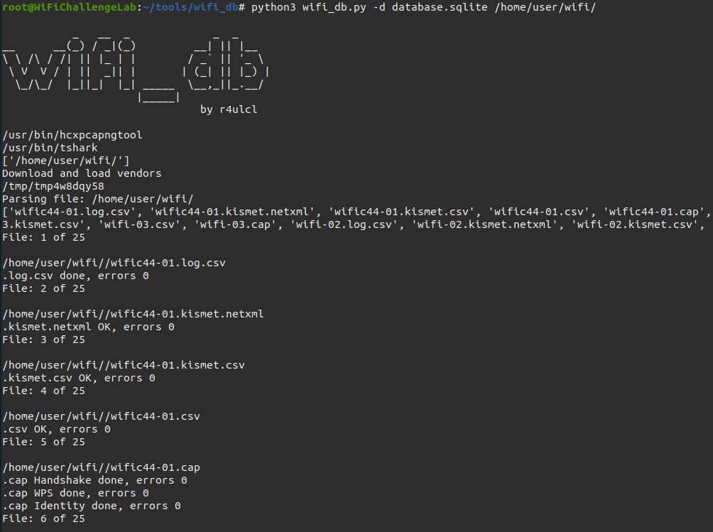
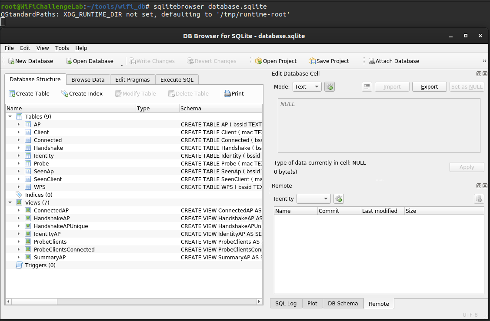

<p align="center">
  
</p>

<p align="center">
   <a href="https://github.com/r4ulcl/wifi_db/releases">
    
  </a>
  <a href="https://github.com/r4ulcl/wifi_db/stargazers">
    
  </a>
  <a href="https://github.com/r4ulcl/wifi_db/network">
    
  </a>
  <a href="https://github.com/r4ulcl/wifi_db/issues">
    
  </a>
  <a href="https://github.com/r4ulcl/wifi_db/blob/main/LICENSE">
    
  </a>
</p>

# wifi_db

[](https://hub.docker.com/r/r4ulcl/wifi_db) [](https://hub.docker.com/r/r4ulcl/wifi_db)

Script to parse Aircrack-ng captures into a SQLite database and extract useful information like handshakes (in 22000 hashcat format), MGT identities, interesting relations between APs, clients and it's Probes, WPS information and a global view of all the APs seen.


## Features

-   Displays if a network is cloaked (hidden) even if you have the ESSID.
-   Shows a detailed table of connected clients and their respective APs.
-   Identifies client probes connected to APs, providing insight into potential security risks usin Rogue APs.
-   Extracts handshakes for use with hashcat, facilitating password cracking.
-   Displays identity information from enterprise networks, including the EAP method used for authentication.
-   Generates a summary of each AP group by ESSID and encryption, giving an overview of the security status of nearby networks.
-   Provides a WPS info table for each AP, detailing information about the Wi-Fi Protected Setup configuration of the network.
-   Logs all instances when a client or AP has been seen with the GPS data and timestamp, enabling location-based analysis.
-   Upload files with capture folder or file. This option supports the use of wildcards (*) to select multiple files or folders.
-   Docker version in Docker Hub to avoid dependencies.
-   Obfuscated mode for demonstrations and conferences.
-   Possibility to add static GPS data.
-   Management Frame Protection (MFP) capable and required column in AP table.


## Install

### From [DockerHub](https://hub.docker.com/r/r4ulcl/wifi_db) (RECOMMENDED)

``` bash
docker pull r4ulcl/wifi_db
``` 

### Manual installation

#### Debian based systems (Ubuntu, Kali, Parrot, etc.)

Dependencies:

- python3 
- python3-pip
- tshark
- hcxtools

``` bash
sudo apt install tshark
sudo apt install python3 python3-pip

git clone https://github.com/ZerBea/hcxtools.git
cd hcxtools
make 
sudo make install
cd ..
```


Installation

``` bash
git clone https://github.com/r4ulcl/wifi_db
cd wifi_db
pip3 install -r requirements.txt 
```

#### Arch

Dependencies:

- python3 
- python3-pip
- tshark
- hcxtools


``` bash
sudo pacman -S wireshark-qt
sudo pacman -S python-pip python

git clone https://github.com/ZerBea/hcxtools.git
cd hcxtools
make 
sudo make install
cd ..
```

Installation

``` bash
git clone https://github.com/r4ulcl/wifi_db
cd wifi_db
pip3 install -r requirements.txt 
```


## Usage

### Usage example in [WiFiChallenge Lab](https://wifichallengelab.com/)

- https://r4ulcl.com/posts/wifi_db-in-wifichallenge-lab/

### Scan with airodump-ng

Run airodump-ng saving the output with -w:

``` bash
sudo airodump-ng wlan0mon -w scan --manufacturer --wps --gpsd
```

### Create the SQLite database using Docker

``` bash
#Folder with captures
CAPTURESFOLDER=/home/user/wifi

# Output database
touch db.SQLITE

docker run -t -v $PWD/db.SQLITE:/db.SQLITE -v $CAPTURESFOLDER:/captures/ r4ulcl/wifi_db
```

- `-v $PWD/db.SQLITE:/db.SQLITE`: To save de output in current folder db.SQLITE file
- `-v $CAPTURESFOLDER:/captures/`: To share the folder with the captures with the docker


### Create the SQLite database using manual installation

Once the capture is created, we can create the database by importing the capture. To do this, put the name of the capture without format.

``` bash
python3 wifi_db.py scan-01
```

In the event that we have multiple captures we can load the folder in which they are directly. And with -d we can rename the output database.

``` bash
python3 wifi_db.py -d database.sqlite scan-folder
```




### Open database

The database can be open with:
- [sqlitebrowser](https://sqlitebrowser.org/)




Below is an example of a ProbeClientsConnected table.


### Arguments

``` bash
usage: wifi_db.py [-h] [-v] [--debug] [-o] [-t LAT] [-n LON] [--source [{aircrack-ng,kismet,wigle}]] [-d DATABASE] capture [capture ...]

positional arguments:
  capture               capture folder or file with extensions .csv, .kismet.csv, .kismet.netxml, or .log.csv. If no extension is provided, all types will
                        be added. This option supports the use of wildcards (*) to select multiple files or folders.

options:
  -h, --help            show this help message and exit
  -v, --verbose         increase output verbosity
  --debug               increase output verbosity to debug
  -o, --obfuscated      Obfuscate MAC and BSSID with AA:BB:CC:XX:XX:XX-defghi (WARNING: replace all database)
  -t LAT, --lat LAT     insert a fake lat in the new elements
  -n LON, --lon LON     insert a fake lon in the new elements
  --source [{aircrack-ng,kismet,wigle}]
                        source from capture data (default: aircrack-ng)
  -d DATABASE, --database DATABASE
                        output database, if exist append to the given database (default name: db.SQLITE)
```

### Kismet

TODO

### Wigle

TODO

## Database

wifi_db contains several tables to store information related to wireless network traffic captured by airodump-ng. The tables are as follows:


-   `AP`: This table stores information about the access points (APs) detected during the captures, including their MAC address (`bssid`), network name (`ssid`), whether the network is cloaked (`cloaked`), manufacturer (`manuf`), channel (`channel`), frequency (`frequency`), carrier (`carrier`), encryption type (`encryption`), and total packets received from this AP (`packetsTotal`). The table uses the MAC address as a primary key.

-   `Client`: This table stores information about the wireless clients detected during the captures, including their MAC address (`mac`), network name (`ssid`), manufacturer (`manuf`), device type (`type`), and total packets received from this client (`packetsTotal`). The table uses the MAC address as a primary key.

-   `SeenClient`: This table stores information about the clients seen during the captures, including their MAC address (`mac`), time of detection (`time`), tool used to capture the data (`tool`), signal strength (`signal_rssi`), latitude (`lat`), longitude (`lon`), altitude (`alt`). The table uses the combination of MAC address and detection time as a primary key, and has a foreign key relationship with the `Client` table.

-   `Connected`: This table stores information about the wireless clients that are connected to an access point, including the MAC address of the access point (`bssid`) and the client (`mac`). The table uses a combination of access point and client MAC addresses as a primary key, and has foreign key relationships with both the `AP` and `Client` tables.

-   `WPS`: This table stores information about access points that have Wi-Fi Protected Setup (WPS) enabled, including their MAC address (`bssid`), network name (`wlan_ssid`), WPS version (`wps_version`), device name (`wps_device_name`), model name (`wps_model_name`), model number (`wps_model_number`), configuration methods (`wps_config_methods`), and keypad configuration methods (`wps_config_methods_keypad`). The table uses the MAC address as a primary key, and has a foreign key relationship with the `AP` table.

-   `SeenAp`: This table stores information about the access points seen during the captures, including their MAC address (`bssid`), time of detection (`time`), tool used to capture the data (`tool`), signal strength (`signal_rssi`), latitude (`lat`), longitude (`lon`), altitude (`alt`), and timestamp (`bsstimestamp`). The table uses the combination of access point MAC address and detection time as a primary key, and has a foreign key relationship with the `AP` table.

-   `Probe`: This table stores information about the probes sent by clients, including the client MAC address (`mac`), network name (`ssid`), and time of probe (`time`). The table uses a combination of client MAC address and network name as a primary key, and has a foreign key relationship with the `Client` table.

-   `Handshake`: This table stores information about the handshakes captured during the captures, including the MAC address of the access point (`bssid`), the client (`mac`), the file name (`file`), and the hashcat format (`hashcat`). The table uses a combination of access point and client MAC addresses, and file name as a primary key, and has foreign key relationships with both the `AP` and `Client` tables.

-  `Identity`: This table represents EAP (Extensible Authentication Protocol) identities and methods used in wireless authentication. The `bssid` and `mac` fields are foreign keys that reference the `AP` and `Client` tables, respectively. Other fields include the identity and method used in the authentication process.


## Views

-  `ProbeClients`: This view selects the MAC address of the probe, the manufacturer and type of the client device, the total number of packets transmitted by the client, and the SSID of the probe. It joins the `Probe` and `Client` tables on the MAC address and orders the results by SSID.
    
-  `ConnectedAP`: This view selects the BSSID of the connected access point, the SSID of the access point, the MAC address of the connected client device, and the manufacturer of the client device. It joins the `Connected`, `AP`, and `Client` tables on the BSSID and MAC address, respectively, and orders the results by BSSID.
    
-  `ProbeClientsConnected`: This view selects the BSSID and SSID of the connected access point, the MAC address of the probe, the manufacturer and type of the client device, the total number of packets transmitted by the client, and the SSID of the probe. It joins the `Probe`, `Client`, and `ConnectedAP` tables on the MAC address of the probe, and filters the results to exclude probes that are connected to the same SSID that they are probing. The results are ordered by the SSID of the probe.
    
-  `HandshakeAP`: This view selects the BSSID of the access point, the SSID of the access point, the MAC address of the client device that performed the handshake, the manufacturer of the client device, the file containing the handshake, and the hashcat output. It joins the `Handshake`, `AP`, and `Client` tables on the BSSID and MAC address, respectively, and orders the results by BSSID.
    
-  `HandshakeAPUnique`: This view selects the BSSID of the access point, the SSID of the access point, the MAC address of the client device that performed the handshake, the manufacturer of the client device, the file containing the handshake, and the hashcat output. It joins the `Handshake`, `AP`, and `Client` tables on the BSSID and MAC address, respectively, and filters the results to exclude handshakes that were not cracked by hashcat. The results are grouped by SSID and ordered by BSSID.
    
-  `IdentityAP`: This view selects the BSSID of the access point, the SSID of the access point, the MAC address of the client device that performed the identity request, the manufacturer of the client device, the identity string, and the method used for the identity request. It joins the `Identity`, `AP`, and `Client` tables on the BSSID and MAC address, respectively, and orders the results by BSSID.
    
-  `SummaryAP`: This view selects the SSID, the count of access points broadcasting the SSID, the encryption type, the manufacturer of the access point, and whether the SSID is cloaked. It groups the results by SSID and orders them by the count of access points in descending order.

## TODO

- [X] Aircrack-ng

- [X] All in 1 file (and separately)

- [ ] Kismet

- [ ] Wigle

- [X] install 

- [X] parse all files in folder -f --folder

- [X] Fix Extended errors, tildes, etc (fixed in aircrack-ng 1.6)

- [X] Support bash multi files: "capture*-1*"

- [X] Script to delete client or AP from DB (mac). - (Whitelist)

- [X] Whitelist to don't add mac to DB (file whitelist.txt, add macs, create DB)

- [X] Overwrite if there is new info (old ESSID='', New ESSID='WIFI')

- [X] Table Handhsakes and PMKID

- [X] Hashcat hash format 22000

- [X] Table files, if file exists skip (full path)

- [ ] Get HTTP POST passwords 

- [ ] DNS querys

---------

This program is a continuation of a part of: https://github.com/T1GR3S/airo-heat

## Author

- Raúl Calvo Laorden (@r4ulcl)

## Support this project

### Buymeacoffee

[](https://www.buymeacoffee.com/r4ulcl)

## License

[GNU General Public License v3.0](https://github.com/r4ulcl/wifi_db/blob/master/LICENSE)
